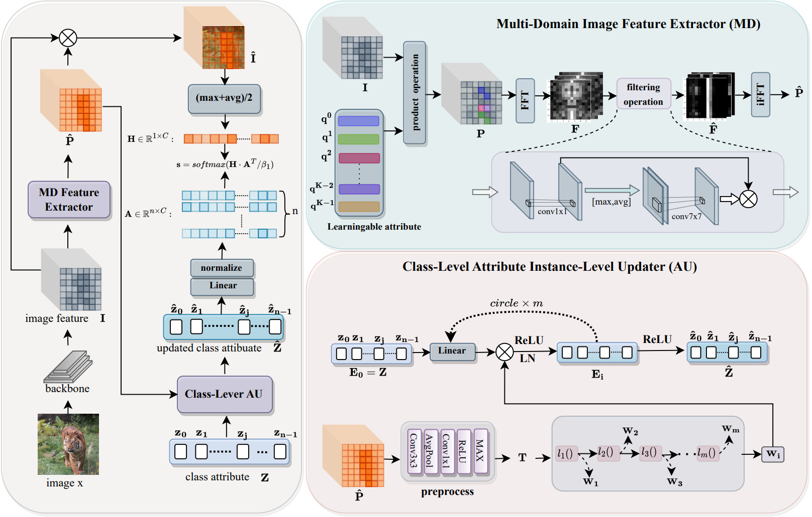

# MDAU
## Instruction
This work proposes an instance-level attribute update method called Multi-Domain Feature-Enhanced Attribute Updater (MDAU) for zero-shot image classification.

## Installation
python==3.6  
clip==1.0  
h5py==3.1.0  
matplotlib==3.3.4  
numpy==1.19.5  
opencv_python==4.6.0.66  
Pillow==10.3.0  
scikit_image==0.17.2
scikit_learn==1.5.0
scipy==1.5.4  
skimage==0.0  
torch==1.10.2+cu111
torchvision==0.11.3+cu111  
tqdm==4.64.0  
## File
The supporting files required to run the code are available for download at the following links  
Pretrained parameters for resnet are stored in pretrained_models https://drive.google.com/drive/folders/1lRajXvGzFOV7NnvQiGsIkjYZ8BhwBnLY?usp=drive_link  
If you want to use the Clip TextEncoder to generate the attribute information, you can download the following helper file and set the parameter use_clip to True (default False) in opt.py.  
https://drive.google.com/drive/folders/1KR--Kr2HzsQIL_TAzAa_6iom-dRXKrE3?usp=drive_link  
https://drive.google.com/drive/folders/1U_P3EhUgsEolT1eLHyP0kKsL7R_psQsw?usp=drive_link  
https://drive.google.com/drive/folders/1OBrFC98XA_mY4lPJG9X0eKRz17R-9-TQ?usp=drive_link    
You can also reproduce our SoTA results directly on the test set. We have stored the trained parameters in the folder “out”. You just need to set the parameter “only_evaluate” to True and change the path parameter “resume”.  
out:https://drive.google.com/drive/folders/1nnfs5UatdOP3Dh74dURz82FD_EYHGL_5?usp=drive_link
## How to run
After everything is installed and configured successfully, you can run the code on each of the three datasets by simply running the three .sh files.
